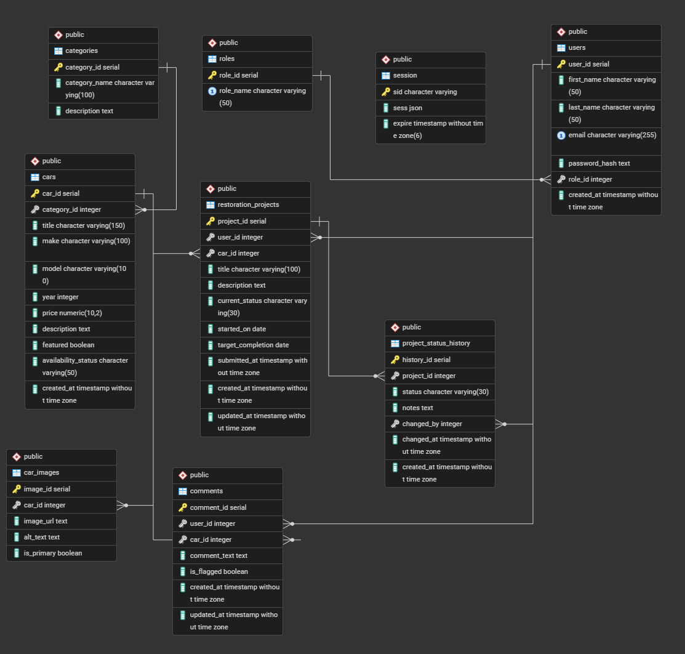

# Vintage Car Showcase and Restoration Hub

## Overview

This project is a full-stack web application that allows users to browse vintage cars, create restoration projects, and interact through comments. The system supports multiple user roles with different permissions and includes administrative tools for managing content.

The application is built using **Node.js, Express, EJS, and PostgreSQL**, following an MVC architecture. It is deployed on Render.

---

## Live Demo

**Render Deployment:**
https://cse340-final-project-2wjq.onrender.com/

---

## Features

### Public Features

* Browse vintage cars with a modern card-based UI
* Filter cars by:

  * Category (multi-select)
  * Availability (multi-select)
  * Search (make, model, description)
  * Sorting (price, year, make)
* Expandable dropdown filter panels with interactive button-style selections
* View detailed car pages with images and descriptions
* View user comments on each car

---

### User Features (Logged In)

* Create restoration projects linked to cars
* Track project status through stages:

  * submitted → approved → in progress → completed
* Edit and delete their own projects
* Add, edit, and delete their own comments

---

### Moderator Features

* Manage all comments (remove inappropriate content)
* Manage project workflow and update project statuses

---

### Admin Features

* Full system access
* Add, edit, and delete cars
* Add, edit, and delete categories
* Manage all users, projects, and comments

---

## User Roles

| Role      | Permissions                               |
| --------- | ----------------------------------------- |
| User      | Manage own projects and comments          |
| Moderator | Manage projects and all comments          |
| Admin     | Full access including cars and categories |

---

## Test Accounts

Use the following accounts to test functionality:

* [admin@test.com](mailto:admin@test.com)
* [mod@test.com](mailto:mod@test.com)
* [user@test.com](mailto:user@test.com)

*(Use the same password configured in your seed data)*

---

## Tech Stack

* Node.js
* Express.js
* EJS (server-side rendering)
* PostgreSQL
* express-session (authentication)
* bcrypt (password hashing)

---

## Architecture

The application follows an **MVC (Model-View-Controller)** pattern:

* **Models** → Database queries and data logic
* **Views** → EJS templates (UI rendering)
* **Controllers** → Request handling and business logic

---

## Database Design

The database includes:

* users
* roles
* categories
* cars
* car_images
* restoration_projects
* project_status_history
* comments
* session

---

## ERD (Entity Relationship Diagram)



---

## Installation / Setup

### 1. Clone the repository

```bash
git clone https://github.com/blaisepalombo/CSE340_FINAL_PROJECT.git
cd CSE340_FINAL_PROJECT
```

### 2. Install dependencies

```bash
npm install
```

### 3. Create a `.env` file

```env
DB_URL=your_database_url
SESSION_SECRET=your_secret
DB_SSL=true
```

### 4. Run the server

```bash
npm start
```

### 5. Open in browser

```
http://localhost:3000
```

---

## Deployment

The application is deployed using **Render** with a hosted PostgreSQL database.

To deploy your own version:

1. Create a PostgreSQL database on Render
2. Add environment variables:

   * DB_URL
   * SESSION_SECRET
   * DB_SSL=true
3. Connect your GitHub repository
4. Deploy as a Web Service

---

## Known Limitations

* Image uploads currently use URLs instead of file uploads
* No pagination for large datasets
* Limited validation on some forms
* Deleting categories may leave cars uncategorized

---

## Future Improvements

* File-based image upload system
* Pagination for large datasets
* Advanced search (price range, year range)
* Notifications for project updates
* UI polish and accessibility improvements
* API layer for potential frontend framework integration

---

## Author

**Blaise Palombo**
BYU–Idaho — Web Design & Development
